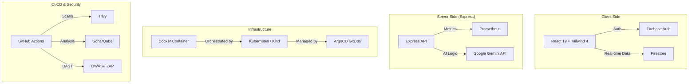

# Building a Production-Ready AI Shopping Assistant: A Complete DevSecOps Journey

In this blog, we'll walk through the creation of the **AI Personalized Shopping Assistant**, a full-stack application that leverages Google Gemini for recommendations and follows industry-standard DevSecOps practices for deployment.

---

## 🏗️ 1. The Architecture

Our application is built on a modern, cloud-native stack designed for scalability and security.

### High-Level Design


### Tech Stack
- **Frontend**: React 19, Zustand (State), Framer Motion (Animations).
- **Backend**: Node.js, Express.
- **AI**: Google Gemini API (`gemini-3-flash-preview`).
- **Database**: Firebase Firestore.
- **DevOps**: Docker, Kubernetes, ArgoCD, GitHub Actions.
- **Monitoring**: Prometheus & Grafana.

---

## 🚀 2. Step-by-Step Execution Guide

### Step 1: Local Setup & Development
First, we initialize the project and install dependencies.

```bash
# Install dependencies
npm install

# Start the development server
npm run dev
```
The app runs on `http://localhost:3000`. It uses **Vite** for the frontend and **Express** for the backend in a single process.

### Step 2: Integrating AI Intelligence
We use the **Gemini API** to power two core features:
1.  **Personalized Recommendations**: Analyzes user behavior logs to suggest products.
2.  **Smart Voice Assistant**: Processes natural language queries like *"Find me shoes under ₹2000"* and checks them against the user's budget.

### Step 3: Containerization (Docker)
To ensure the app runs everywhere, we created a multi-stage `Dockerfile`.

```dockerfile
# Build Stage
FROM node:20-slim AS builder
...
RUN npm run build

# Production Stage
FROM node:20-slim
...
CMD ["tsx", "server.ts"]
```

### Step 4: Security First (DevSecOps)
Before deploying, we run a suite of security tools:
- **GitLeaks**: Scans for accidental secret commits.
- **Trivy**: Scans the Docker image for OS vulnerabilities.
- **SonarQube**: Analyzes code quality and security hotspots.
- **OWASP ZAP**: Performs dynamic penetration testing on the running API.

### Step 5: Kubernetes Deployment (Kind & ArgoCD)
We deploy to a **Kind** (Kubernetes in Docker) cluster using **ArgoCD** for GitOps.

1.  **Manifests**: Located in `/k8s`, defining the Deployment, Service, and Secrets.
2.  **GitOps**: ArgoCD monitors the repository and automatically syncs the cluster state with the code.

### Step 6: Automated CI/CD (GitHub Actions)
The entire lifecycle is automated in `.github/workflows/main.yml`:
1.  **Push** to `main`.
2.  **CI**: Lint, Build, and Security Scans.
3.  **CD**: Build Docker image -> Push to Registry -> Update K8s Manifests -> ArgoCD Sync.

---

## 📊 3. Observability
We don't just deploy; we monitor.
- **Prometheus**: Scrapes the `/metrics` endpoint in our Express server.
- **Grafana**: Provides a visual dashboard for request latency, error rates, and system health.

---

## 🏁 4. Conclusion
Building an "AI Shopping Assistant" isn't just about the AI; it's about the **ecosystem** around it. By combining **Gemini's intelligence** with **Firebase's real-time capabilities** and **Kubernetes' orchestration**, we've created a production-ready platform that is secure, scalable, and observable.

### 📂 Repository Structure
- `/src`: Frontend React components and logic.
- `/server.ts`: Express backend with Prometheus integration.
- `/k8s`: Kubernetes manifests.
- `/scripts`: Security automation scripts.
- `/.github`: CI/CD workflow definitions.
- `swagger.yaml`: API documentation.

---
*Happy Coding!* 🚀
