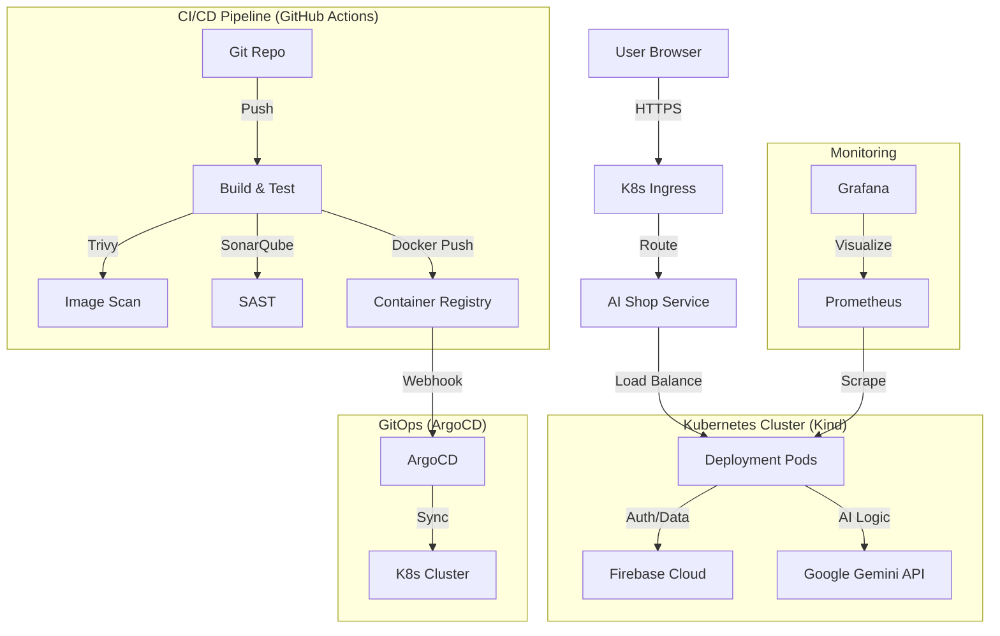

# AI Personalized Shopping Assistant - Industry Standard Deployment

This project follows a modern **DevSecOps** and **GitOps** architecture for high scalability, security, and observability.

## 🏗️ Architecture Diagram



## 🚀 Step-by-Step Deployment Instructions

### 1. Prerequisites
- Docker & Kind installed
- Kubectl installed
- ArgoCD CLI

### 2. Local Cluster Setup
```bash
# Create a Kind cluster
kind create cluster --name ai-shop

# Install ArgoCD
kubectl create namespace argocd
kubectl apply -n argocd -f https://raw.githubusercontent.com/argoproj/argo-cd/stable/manifests/install.yaml
```

### 3. Build & Security Scan
```bash
# Build the image
docker build -t ai-shop-assistant:latest .

# Run security scans
chmod +x scripts/security-scan.sh
./scripts/security-scan.sh
```

## 🛠️ Infrastructure Automation
To simplify the setup of the entire environment (Git, Docker, Kubernetes, Helm, ArgoCD, Prometheus, and Grafana), use the provided automation script:

```bash
# Make the script executable
chmod +x scripts/setup-infra.sh

# Run the setup (requires sudo for some tools)
./scripts/setup-infra.sh
```

This script will:
1.  Install **Git** and **Docker**.
2.  Install **Kubectl** and **Kind**.
3.  Create a local Kubernetes cluster named `ai-shop`.
4.  Install **Helm**.
5.  Deploy **ArgoCD** into the `argocd` namespace.
6.  Deploy **Prometheus** and **Grafana** into the `monitoring` namespace using the `kube-prometheus-stack` Helm chart.

### 4. GitOps Deployment (ArgoCD)
1. Push your code to a Git repository.
2. Create an ArgoCD Application:
```bash
argocd app create ai-shop \
    --repo https://github.com/youruser/ai-shop-assistant.git \
    --path k8s \
    --dest-server https://kubernetes.default.svc \
    --dest-namespace default
```

### 5. Monitoring
- **Prometheus**: Scrapes `/metrics` endpoint from the Express server.
- **Grafana**: Dashboard imported from `monitoring/grafana-dashboard.json`.

## 📖 API Documentation
Formal API documentation is available in the `swagger.yaml` file. You can view it using any OpenAPI viewer (like Swagger UI or Redoc).

- **Health Check**: `GET /api/health`
- **Metrics**: `GET /metrics`

## 🤖 CI/CD Pipeline (GitHub Actions)

The project includes a comprehensive GitHub Actions workflow (`.github/workflows/main.yml`) that automates the entire lifecycle:

1.  **Build & Test**: Installs dependencies, lints, and builds the app.
2.  **Security Scans**:
    *   **GitLeaks**: Scans for secrets.
    *   **Trivy**: Scans the filesystem for vulnerabilities.
    *   **SonarQube**: Static analysis for code quality.
3.  **Docker Build**: Builds and pushes the production image to Docker Hub.
4.  **GitOps Sync**: Updates the Kubernetes manifests in the `k8s/` directory, which triggers **ArgoCD** to sync the cluster.

### Required Secrets for GitHub Actions:
- `DOCKERHUB_USERNAME`: Your Docker Hub username.
- `DOCKERHUB_TOKEN`: Your Docker Hub personal access token.
- `SONAR_TOKEN`: Token from SonarQube.
- `SONAR_HOST_URL`: URL of your SonarQube instance.

## 🔐 Security Features
- **GitLeaks**: Prevents hardcoded secrets in commits.
- **Trivy**: Scans the base image for vulnerabilities.
- **SonarQube**: Deep code quality and security analysis.
- **OWASP ZAP**: Automated penetration testing on the running service.

## 🛠️ Tech Stack
- **Frontend**: React 19 + Tailwind CSS
- **Backend**: Express.js
- **Database**: Firebase Firestore
- **Orchestration**: Kubernetes (Kind)
- **GitOps**: ArgoCD
- **Monitoring**: Prometheus & Grafana
